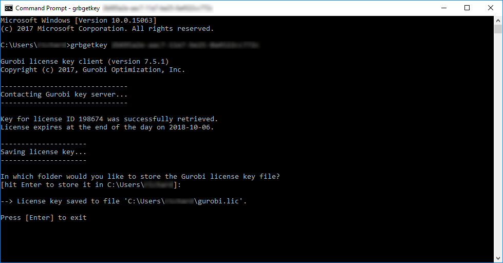

# Setting up your computer {#setup}

You will need to have both R and RStudio installed on your computer to complete this workshop. Although it is not imperative that you have the latest version of RStudio installed, **you will need the at least version 4.0 of R installed **. Please note that you might need administrative permissions to install these programs. After installing them, you will also need to install some R packages too. Finally, you will also need to download the data for this workshop.

## R {#r}

The [R statistical computing environment](https://www.r-project.org) can be downloaded from the Comprehensive R Archive Network (CRAN). Specifically, you can download the latest version of R (version `r as.character(getRversion())`) from here: https://cloud.r-project.org. Please note that you will need to download the correct file for your operating system (i.e. Linux, Mac OSX, Windows).

## RStudio {#rstudio}

[RStudio](https://www.rstudio.com) is an integrated development environment (IDE). In other words, it is a program that is designed to make your R programming experience more enjoyable. During this workshop, you will interact with R through RStudio---meaning that you will open RStudio to code in R. You can download the latest version of RStudio here: http://www.rstudio.com/download. When you start RStudio, you will see two main parts of the interface:
  
```{r, out.width = "100%", echo = FALSE}
  knitr::include_graphics("images/rstudio-console.png")
```

You can type R code into the _Console_ and press the enter key to run code.

## R packages {#r-packages}

An R package is a collection of R code and documentation that can be installed to enhance the standard R environment with additional functionality. Currently, there are over fifteen thousand R packages available on CRAN. Each of these R packages are developed to perform a specific task, such as [reading Excel spreadsheets](https://cran.r-project.org/web/packages/readxl/index.html), [downloading satellite imagery data](https://cran.r-project.org/web/packages/MODIStsp/index.html), [downloading and cleaning protected area data](https://cran.r-project.org/web/packages/wdpar/index.html), or [fitting environmental niche models](https://cran.r-project.org/web/packages/ENMeval/index.html). In fact, R has such a diverse ecosystem of R packages, that the question is almost always not "can I use R to ...?" but "what R package can I use to ...?". During this workshop, we will use several R packages. To install these R packages, please enter the code below in the _Console_ part of the RStudio interface and press enter. Note that you will require an Internet connection and the installation process may take some time to complete.

```{r, eval = FALSE}
install.packages(c("sf", "dplyr", "sp", "rgeos", "rgdal", "raster",
                   "units", "prioritizr", "prioritizrdata", "Rsymphony",
                   "mapview", "assertthat", "remotes", "gridExtra",
                   "BiocManager"))
BiocManager::install("lpsymphony")
```

Some of the new code in this workshop relies on _prioritizr R_ package v6.0 which is only available on Github at the moment. The CRAN version is currently 5.03. You do not have to install v6.0 if you don't wish to. There are only a few instances of code which will not be able to run. But if you want to try v6.0 you can run:
```{r, eval = FALSE}
devtools::install_github("prioritizr/prioritizr")
```

This will require you to have all the tools required for building packages installed on your computer but RStudio should help with the process and you can get help from here: https://support.rstudio.com/hc/en-us/articles/200486498-Package-Development-Prerequisites.

## Optimisation Software
While it possible to use the `lpsymphony` package installed above, _Gurobi_ is the most powerful and fastest solver that the _prioritizr R_ package can use to solve conservation planning problems. This section will walk you through the process of setting up _Gurobi_ on your computer. If you encounter any problems while following the instructions below, check out the [official _Gurobi_ documentation](https://www.gurobi.com/documentation/). If you can't solve the problems, don't worry. We can use `lpsymphony`.

### Obtaining a license

_Gurobi_ is a commercial computer program. [This means that users will need to obtain a license for _Gurobi_ before they can use it](https://www.gurobi.com/products/licensing-pricing/licensing-overview). Although academics can obtain a special license at no cost, individuals that are not affiliated with a recognized educational institution may need to purchase a license to use _Gurobi_. If you are an academic that is affiliated with an educational institution, you can take advantage of the [special academic license](https://www.gurobi.com/downloads/end-user-license-agreement-academic/) to use _Gurobi_ for no cost. Once you have signed up for a free account you can request a [free academic license](https://www.gurobi.com/downloads/end-user-license-agreement-academic/).

<br><center>{ width=75% }</center><br>

Once you accept the Terms Of Service you can generate a license.

<br><center>{ width=75% }</center><br>

Now, copy and save the `grbgetkey XXXXXXXX-XXXX-XXXX-XXXX-XXXXXXXXXXXX` command for later use.

### Downloading the _Gurobi_ software suite

After obtaining a license, you will need to download a copy of the _Gurobi_ installer to your computer. To achieve this, visit the [_Gurobi_ downloads web page](https://www.gurobi.com/downloads/gurobi-optimizer) and download the correct version of the installer for your operating system.

### Software installation

The installation process for the _Gurobi_ software suite depends on the type of operating system you have installed on your computer. Fortunately, _Gurobi_ provide platform-specific ["Quick Start Guides"](https://www.gurobi.com/documentation/) for [Windows](https://www.gurobi.com/documentation/8.1/quickstart_windows/software_installation_guid.html#section:Installation), [Mac OSX](https://www.gurobi.com/documentation/8.1/quickstart_mac/software_installation_guid.html), and [Linux](https://www.gurobi.com/documentation/8.1/quickstart_linux/software_installation_guid.html) systems that should help with this. Briefly, on Windows and Mac systems, you just need to double-click on the _Gurobi_ installer, follow the prompts, and the installer will take care of rest. 

After installing the _Gurobi_ software suite on your computer, you will need to activate your license.

### License activation

Now we will activate the _Gurobi_ software using the license you downloaded earlier. Please note that the correct set of instructions depends on your system and license. In most cases, you should follow the instructions in the "Local license activation". If, and only if, you are activating a special Academic license on a networked computer that is not connected to your university's network (e.g. a cloud-based system), then please follow the instructions below in the "Cloud license activation over SSH" section.

### Local license activation

To activate the license, simply copy and paste the `grbgetkey` command into your computer's command prompt or terminal (note that Windows users can open the command prompt by typing `cmd` in the search box and pressing the `enter` key). After running the `grbgetkey` command with the correct license code, you should see output that looks something like that in the screen shot below.

<br><center>{ width=75% }</center><br>

### Install gurobi R
To install the R package, instructions can be found [here](https://www.gurobi.com/documentation/9.1/refman/ins_the_r_package.html). Briefly you can install it by substituting `<R-package-file>` in the code below for the location of the Gurobi software on your computer.
```{r, eval=FALSE}
install.packages('<R-package-file>', repos=NULL)

# For a Mac it would be:
install.packages("/Library/gurobi911/mac64/R/gurobi_9.1-1_R_4.0.2.tgz", repos = NULL)
```
Depending on your local R environment you might need to install the R package slam. To do this, you should issue the following command within R:
```{r, eval=FALSE}
install.packages('slam')
```