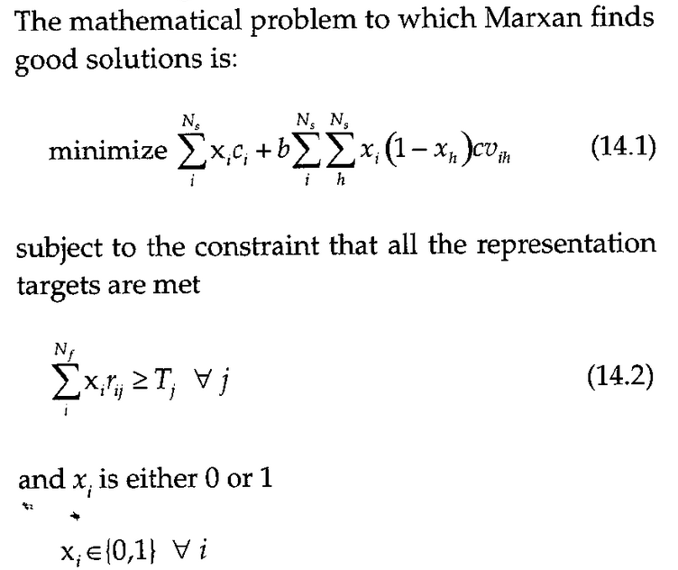
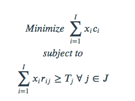

# Overview of the conservation planning problem

```{r, include = FALSE}
h = 3.5
w = 3.5
is_check <- ("CheckExEnv" %in% search()) || any(c("_R_CHECK_TIMINGS_",
                                                  "_R_CHECK_LICENSE_") %in% names(Sys.getenv()))
knitr::opts_chunk$set(fig.align = "center", eval = !is_check,
                      root.dir = normalizePath("../.."))
```

## Summary

The _prioritizr R_ package uses integer linear programming (ILP) techniques to provide a flexible interface for building and solving conservation planning problems [@r11; @r16]. It supports a broad range of objectives, constraints, and penalties that can be used to custom-tailor conservation planning problems to the specific needs of a conservation planning exercise. 

Once built, conservation planning problems can be solved using a variety of commercial and open-source exact algorithm solvers. In contrast to the algorithms conventionally used to solve conservation problems, such as heuristics or simulated annealing [@r3], the exact algorithms used here are guaranteed to find optimal solutions. Furthermore, conservation problems can be constructed to optimize the spatial allocation of different management zone (or actions), meaning that conservation practitioners can identify solutions that benefit multiple stakeholders. 

## Introduction

Systematic conservation planning is a rigorous, repeatable, and structured approach to designing new protected areas that efficiently meet conservation objectives [@r4]. Historically, conservation decision-making has often evaluated parcels opportunistically as they became available for purchase, donation, or under threat. Although purchasing such areas may improve the _status quo_, such decisions may not substantially enhance the long-term persistence of target species or communities. Faced with this realization, conservation planners began using decision support tools to help simulate alternative reserve designs over a range of different biodiversity and management goals and, ultimately, guide protected area acquisitions and management actions. Due to the systematic, evidence-based nature of these tools, conservation prioritization can help contribute to a transparent, inclusive, and more defensible decision making process.


  There are several concepts that underpin the conservation planning problems. Some of them are:
  
  - `Study Area` : A conservation planning exercise typically starts by defining a study area. This study area should encompass all the areas relevant to the decision maker or the hypothesis being tested. The extent of a study area could encompass a few important localities [e.g. @r18], a single state [e.g. @r17], an entire country [@r19], or the entire planet [@r20].
  - `Planning units` : Planning units are the building blocks of a reserve system. Each planning unit represents a discrete locality in the study area that can be managed independently of other areas. The general idea is that some combination of the planning units can be selected for conservation actions (e.g. protected area establishment, habitat restoration). Planning units are often created as square or hexagon cells that are sized according to the scale of the conservation actions, and the resolution of the data that underpin the planning exercise [but see @r5].
- `Features` : A conservation feature is a measurable, spatially definable component of biodiversity that is to be conserved within a reserve network (e.g., species, communities, habitat types, populations, etc.). After identifying the set of relevant conservation features for a conservation planning exercise, spatially explicit data need to be obtained for each and every feature to describe their spatial distribution (e.g. habitat suitability data, probability of occurrence data, presence/absence data). This is important to ensure that conservation features are adequately covered (represented) by prioritizations. 
- `Target / Representation target` : Each conservation feature is given a target. Targets are the quantitative values (amounts) of each conservation feature to be achieved in the final reserve solution
- `Cost` : The cost of including a planning unit in a reserve system. This cost should reflect the socio-political constraints to setting aside that planning unit for conservation actions. This could be: total area, cost of acquisition or any other relative social, economic or ecological measure (e.g loss of fishing or logging land). Each planning unit is assigned one cost (*although several measures can be combined to create a cost metric*)
- `Boundary Length Modifier (BLM)` : A variable controlling how much emphasis to place on minimising the overall reserve system boundary length relative to the reserve system cost. Higher BLM values will produce a more compact reserve system

The _prioritizr R_ package is designed to help you build and solve conservation planning problems. Specifically, prioritizations are generated by using formulating a mathematical optimization problem and then solving it to generate a solution. These mathematical optimization problems are formulated using the planning unit data, cost data, and feature data, and with information related to the overarching aim of the prioritization process. In general, the goal of an optimization problem is to minimize (or maximize) an _objective function_ that is calculated using a set of _decision variables_, subject to a series of constraints to ensure that solution exhibits specific properties. The objective function describes the quantity which we are trying to minimize (e.g. cost of the solution) or maximize (e.g. number of features conserved). The decision variables describe the entities that we can control, and indicate which planning units are selected for conservation management and which of those are not. The constraints can be thought of as rules that the need decision variables need to follow. 


**See the next video**
  <iframe width = "800" height = "500" src = "https://www.youtube.com/embed/1IDeKJJO7s8" frameborder = "0" allowfullscreen></iframe>
  


A wide variety of approaches have been developed for solving optimization problems. Reserve design problems are frequently solved using simulated annealing [@r6] or heuristics [@r8; @r7]. These methods are conceptually simple and can be applied to a wide variety of optimization problems. However, they do not scale well for large or complex problems [@r1]. Additionally, these methods cannot tell you how close any given solution is to the optimal solution. The _prioritizr R_ package uses exact algorithms to efficiently solve conservation planning problems to within a pre-specified a optimality gap. In other words, you can specify that you need the optimal solution (i.e. a gap of 0%) and the algorithms will, given enough time, find a solution that meets this criteria. In the past, exact algorithms have been too slow for conservation planning exercises [@r9]. However, improvements over the last decade mean that they are now much faster [@r23; @r1].

In this package, optimization problems are expressed using _integer linear programming_ (ILP) so that they can be solved using (linear) exact algorithm solvers. The general form of an integer programming problem can be expressed in matrix notation using the following equation.

$$\text{Minimize} \space \boldsymbol{c}^\text{T} \boldsymbol{x} \space
\space \text{subject to} \space A\boldsymbol{x}
\space \Box \space \boldsymbol{b}$$
  
  Here, where $x$ is a vector of decision variables, $c$ and $b$ are vectors of known coefficients, and $A$ is the constraint matrix. The final term specifies a series of structural constants and the $\Box$ symbol is used to indicate that the relational operators for the constraints can be either $\geq$, $=$, or $\leq$. In the context of a conservation planning problem, $c$ could be used to represent the planning unit costs, $A$ could be used to store the data showing the presence / absence (or amount) of each feature in each planning unit, $b$ could be used to represent minimum amount of habitat required for each species in the solution, the $\Box$ could be set to $\geq$ symbols to indicate that the total amount of each feature in the solution must exceed the quantities in $b$. But there are many other ways of formulating the reserve selection problem [@r11].

## Package overview

The _prioritizr R_ package contains eight main types of functions. These
functions are used to:
  
  * create a new conservation planning [problem](https://prioritizr.net/reference/problem.html) by specifying the planning units, features, and management zones of conservation interest (e.g. species, ecosystems).
* add an [objective](https://prioritizr.net/reference/objectives.html) to a conservation planning problem.
* add [targets](https://prioritizr.net/reference/targets.html) to a problem to specify how much of each feature is desired or required to be conserved in the solutions.
* add [constraints](https://prioritizr.net/reference/constraints.html) to a conservation planning problem to ensure that solutions exhibit specific properties (e.g. select specific planning units for protection).
* add [penalties](https://prioritizr.net/reference/penalties.html) to a problem to penalize solutions according to specific metric (e.g. connectivity).
* add [decisions](https://prioritizr.net/reference/decisions.html) to a problem to specify the nature of the decisions in the problem.
* add methods to generate a [portfolio](https://prioritizr.net/reference/portfolios.html) of solutions.
* add a [solver](https://prioritizr.net/reference/solvers.html) to a conservation problem to specify which software should be used to generate solutions and customize the optimization process.
* [solve](https://prioritizr.net/reference/solve.html) a conservation problem.
* evaluate a solution by computing [summary](https://prioritizr.net/reference/summaries.html) statistics.
* evaluate the relative [importance](https://prioritizr.net/reference/importance.html) (irreplaceability) of planning units selected in a solution.


#### Marxan problem equation
```{r Marxan problem equation, echo = FALSE, fig.cap = "Marxan problem equation", out.width = '70%', fig.align = "center"}

```
#### Prioritizr minimum set objective

The minimum set objective for the reserve design problem can be expressed mathematically for a set of planning units (*I* indexed by *i* ) and a set of features (*J* indexed by *j*) as

```{r Prioritizr minimum objective, echo = FALSE, fig.cap = "Prioritizr minimum set objective", out.width = '150%', fig.align = "center"}

```

- *xi* : the decision variable (e.g. specifying whether planning unit *i* has been selected (1) or not (0))
- *ci* : the cost of planning unit *i*
  - *rij* : the amount of feature *j* in planning unit *i*
  - *Tj* : the target for feature *j*
  
  This says find the set of planning units that meets all the representation targets while minimizing the overall cost

### Minimum Reserve Set Problem 

The `Prioritizr` minimum set objective seeks to find the set of planning units that minimizes the overall cost of a reserve network, while meeting a set of representation targets for the conservation features. This objective is equivalent to a simplified Marxan reserve design problem with the Boundary Length Modifier (BLM) set to zero.


