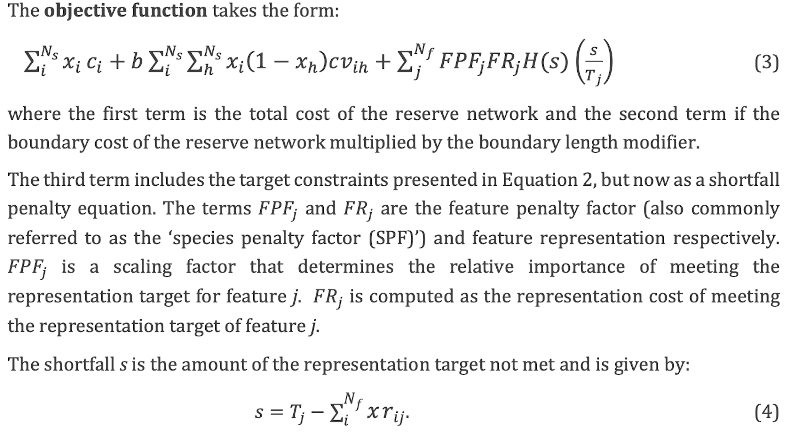
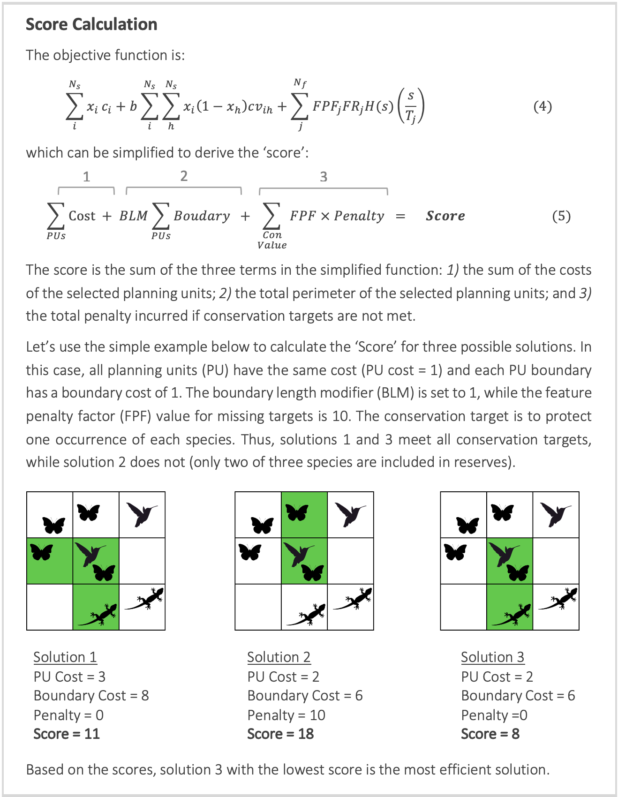

# Overview of the conservation planning problem

## Summary

The _prioritizr R_ package uses integer linear programming (ILP) techniques to provide a flexible interface for building and solving conservation planning problems [@r11; @r16]. It supports a broad range of objectives, constraints, and penalties that can be used to customize conservation planning problems to the specific needs of a conservation planning exercise. 

Once built, conservation planning problems can be solved using a variety of commercial and open-source exact algorithm solvers. In contrast to the algorithms conventionally used to solve conservation problems, such as heuristics or simulated annealing [@r3], the exact algorithms used here are guaranteed to find optimal solutions. 

Furthermore, conservation problems can be constructed to optimize the spatial allocation of different management zone (or actions), meaning that conservation practitioners can identify solutions that benefit multiple stakeholders. 

## Introduction

Systematic conservation planning is a rigorous, repeatable, and structured approach to designing new protected areas that efficiently meet conservation objectives [@r4]. 

Historically, conservation decision-making has often evaluated parcels opportunistically as they became available for purchase, donation, or under threat. Although purchasing such areas may improve the _status quo_, such decisions may not substantially enhance the long-term persistence of target species or communities. 

Therefore conservation planners began using decision support tools to help simulate alternative reserve designs over a range of different biodiversity and management goals and, ultimately, guide protected area acquisitions and management actions. Due to the systematic, evidence-based nature of these tools, **conservation prioritization can help contribute to a transparent, inclusive, and more defensible decision making process**.

### Overall Concepts
There are several concepts that underpin the conservation planning problems. Some of them are:
  
* **Study Area**: A conservation planning exercise typically starts by defining a study area. This study area should encompass all the areas relevant to the decision maker or the hypothesis being tested. The extent of a study area could encompass a few important localities [e.g. @r18], a single state [e.g. @r17], an entire country [@r19], or the entire planet [@r20].
* **Planning units**: Planning units are the building blocks of a reserve system. Each planning unit represents a discrete locality in the study area that can be managed independently of other areas. The general idea is that some combination of the planning units can be selected for conservation actions (e.g. protected area establishment, habitat restoration). Planning units are often created as square or hexagon cells that are sized according to the scale of the conservation actions, and the resolution of the data that underpin the planning exercise [but see @r5].
* **Features**: A conservation feature is a measurable, spatially definable component of biodiversity that is to be conserved within a reserve network (e.g., species, communities, habitat types, populations, etc.). After identifying the set of relevant conservation features for a conservation planning exercise, spatially explicit data need to be obtained for each and every feature to describe their spatial distribution (e.g. habitat suitability data, probability of occurrence data, presence/absence data). This is important to ensure that conservation features are adequately covered (represented) by prioritizations. 
* **Target**: Each conservation feature is given a target. Targets are the quantitative values (amounts) of each conservation feature to be achieved in the final reserve solution
* **Cost**: The cost of including a planning unit in a reserve system. This cost should reflect the socio-political constraints to setting aside that planning unit for conservation actions. This could be: total area, cost of acquisition or any other relative social, economic or ecological measure (e.g loss of fishing or logging land). Each planning unit is assigned one cost (*although several measures can be combined to create a cost metric*)
* **Objectives**: An objective is used to specify the overall goal of a conservation planning problem. All conservation planning problems involve minimizing or maximizing some kind of objective
* **Penalties**: A penalty can be applied to a conservation planning problem to penalize solutions according to a specific metric. Penalties---unlike constraints---act as an explicit trade-off with the objective being minimized or maximized.
* **Constraints**: Constraints can be used to ensure that solutions exhibit a range of different characteristics. For instance, they can be used to lock in or lock out certain planning units from the solution, such as protected areas or degraded land (respectively).
* **Portfolios**: Conservation planning exercises rarely have access to all the data needed to identify the truly perfect solution. This is because available data may lack important details or contain errors. As such, conservation planners can help decision makers by providing them with a portfolio of solutions to inform their decision.

### Choosing Marine Reserves: The C.A.R.E. Approach

<iframe width = "700" height = "500" src = "https://www.youtube.com/embed/1IDeKJJO7s8" frameborder = "0" allowfullscreen></iframe>

### The Optimisation Problem

The _prioritizr R_ package is designed to help you build and solve conservation planning problems. Specifically, prioritizations are generated by using formulating a mathematical optimization problem and then solving it to generate a solution. These mathematical optimization problems are formulated using the planning unit data, cost data, and feature data, and with information related to the overarching aim of the prioritization process. 

In general, the goal of an optimization problem is to minimize (or maximize) an _objective function_ that is calculated using a set of _decision variables_, subject to a series of _constraints_ to ensure that solution exhibits specific properties. The _objective function_ describes the quantity which we are trying to minimize (e.g. cost of the solution) or maximize (e.g. number of features conserved). The _decision variables_ describe the entities that we can control, and indicate which planning units are selected for conservation management and which of those are not. The _constraints_ can be thought of as rules that the need decision variables need to follow. 

```{r Problem equation, echo = FALSE, fig.cap = "Prioritizr problem equation", out.width = '100%', fig.align = "center"}

```


```{r Objective, echo = FALSE, fig.cap = "Prioritizr Objective", out.width = '100%', fig.align = "center"}

```


```{r Box, echo = FALSE, fig.cap = "Score Calculation", out.width = '100%', fig.align = "center"}

```


A wide variety of approaches have been developed for solving optimization problems. Reserve design problems are frequently solved using simulated annealing [@r6] or heuristics [@r8; @r7]. These methods are conceptually simple and can be applied to a wide variety of optimization problems. However, they do not scale well for large or complex problems [@r1]. Additionally, these methods cannot tell you how close any given solution is to the optimal solution. 

The _prioritizr R_ package uses exact algorithms to efficiently solve conservation planning problems to within a pre-specified a optimality gap. In other words, you can specify that you need the optimal solution (i.e. a gap of 0%) and the algorithms will, given enough time, find a solution that meets this criteria. 

In the past, exact algorithms have been too slow for conservation planning exercises [@r9]. However, improvements over the last decade mean that they are now much faster [@r23; @r1]. In this package, optimization problems are expressed using _integer linear programming_ (ILP) so that they can be solved using (linear) exact algorithm solvers.
